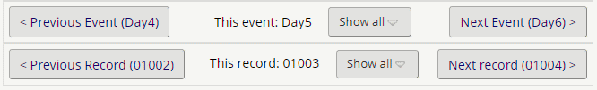

# Record and Event Pager
Adds a paging control to the bottom of data entry forms, allowing the user to navigate quickly and easily between different events in a record, and records in a project.

Event Pager:
Clicking next event or previous event takes the user to the first available instrument at that event that they have permission to view. 
If the  user does not have permissions to view any of the instruments at a certain event, this event will not appear in the pager.

Clicking the 'Show All' button displays a list of links to all the events in the project.

Record pager:
This enables the user to page from an instrument in the current record to same instrument in the next or previous records. 
Clicking the 'Show All' button will display a list of links to all the records that are in the user's Data Access Group. For users who are not in a DAG, it will display a list of all the records in the project.

NB. The record pager has been tested in projects with up to 16,000 records with no noticeable performance impact. However, older PCs or browsers may struggle to render the 'show all' control with large numbers of records.